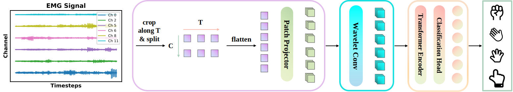

# WaveFormer: A Lightweight Transformer Model for sEMG-based Gesture Recognition

[](https://arxiv.org/abs/2506.11168)
[](https://opensource.org/licenses/MIT)

🎉 **Accepted at the 2025 12th International IEEE/EMBS Conference on Neural Engineering (NER)!**

This is the official PyTorch implementation of the paper **"WaveFormer: A Lightweight Transformer Model for sEMG-based Gesture Recognition"**.

WaveFormer is a lightweight transformer-based architecture specifically tailored for surface electromyographic (sEMG) gesture recognition. Traditional deep learning models are often too large and computationally expensive for deployment on resource-constrained embedded systems. Our work addresses this challenge, demonstrating that careful architectural design can eliminate the traditional trade-off between model size and accuracy.

## ✨ Key Features

* **Lightweight Design**: With only **3.1 million parameters**, the model is perfectly suited for wearable devices and embedded systems with limited computational power.
* **Innovative WaveletConv Module**: Introduces a novel learnable wavelet transform that adaptively integrates time-domain and frequency-domain features to enhance feature extraction. It uses depthwise separable convolutions to ensure both efficiency and compactness.
* **Efficient Transformer Architecture**: Employs efficient Transformer blocks with Rotary Positional Embedding (RoPE) to effectively capture long-range dependencies in the sEMG signals.
* **State-of-the-Art Performance**: Achieves SOTA performance on multiple public sEMG datasets, outperforming much larger foundation models and other lightweight architectures.
    * **95%** classification accuracy on the EPN612 dataset.
    * **81.93%** accuracy on the challenging Ninapro DB6 inter-session protocol.
* **Real-Time Inference**: Achieves an inference latency of just **6.75 ms** per sample on a standard CPU (Intel Core i7-11800H) with INT8 quantization, making it ideal for real-time applications.

## 🔬 Model Architecture

The WaveFormer pipeline is illustrated below:

<p align="center">
   </p>

<p align="center">
   </p>
1.  **Input Signal Processing**: The raw multi-channel sEMG signal (`C x T`) is first preprocessed, including filtering and normalization.
2.  **Patch Embedding**: A learnable 2D convolution layer partitions the signal into non-overlapping patches and maps them to a fixed-dimensional latent vector, creating a 2D feature map (`D x C x N`).
3.  **WaveletConv**: This core module performs multi-level wavelet decomposition and reconstruction on the 2D feature map to extract rich, multi-scale time-frequency features.
4.  **Transformer Encoder**: The wavelet-enhanced features are flattened and fed into a 6-layer Transformer encoder. The encoder uses **RoPEAttention** to capture global temporal correlations.
5.  **Classification Head**: Finally, a simple linear classification head predicts the gesture class based on the Transformer's output.

## 🚀 Getting Started

### 1. Setup Environment

```bash
# Clone this repository
git clone [https://github.com/your-username/WaveFormer.git](https://github.com/your-username/WaveFormer.git)
cd WaveFormer

# Create and activate a conda environment (recommended)
conda create -n waveformer python=3.11
conda activate waveformer

# Install dependencies
pip install -r requirements.txt
```

### 2. Prepare Datasets

We used four public datasets in our experiments. Please download them from the official sources:
* [**Ninapro DB5**](https://ninapro.hevs.ch/instructions/DB5.html)
* [**Ninapro DB6**](https://ninapro.hevs.ch/instructions/DB6.html)
* [**EPN-612**](https://zenodo.org/records/4421500)
* [**UCI EMG**](https://archive.ics.uci.edu/dataset/481/emg+data+for+gestures)

We provide preprocessing scripts in the `data/` directory. After downloading the raw data, you can process it using a command like the following:

```bash
python data/db5_data_processor.py \
    --input_data data/DB5 \
    --output_h5 data/processed/db5_h5 \
    --output_pt data/processed/db5_pytorch \
    --window_size 200 \
    --stride 50
```

### 3. Data Formatting

The data is presented as a Python list of tuples `(domain: str, sample: torch.Tensor)`. Each `sample` should have the shape `(C, V, T)`, where `C`, `V`, and `T` represent the number of channels (similar to RGB channels in images; default: 1), the number of variates, and the number of time points, respectively. For fine-tuning and linear probing, if the `domain` was previously seen during pre-training, positional embeddings for the variates are loaded from the checkpoint; otherwise, they are intialised randomly.

### 4. Train & Evaluate

We provide a comprehensive script `train.sh` to handle both training and evaluation. You can configure the parameters inside the script and then run it.

```bash
./train.sh
```

Below is an example of the contents of `train.sh`, showing the main parameters and the `torchrun` command for fine-tuning:

```bash
#!/bin/bash

# --- Training Parameters ---
num_workers=8
sd=42
nb_classes=6
input_channels=1
input_variates=8
time_steps=1000
patch_height=1
patch_width=50
model="Waveformer_base"
bs=128          # Lower batch size to reduce GPU load
epochs=30
lr=4e-5         # Slightly increased learning rate
warmup_epochs=5 # Longer warmup for stability
weight_decay=1e-4
drop_path=0.01
clip_grad=1.0   # Gradient clipping to prevent explosion
patience=5      # Early stopping patience
max_delta=0.01 
smoothing=0.0

# --- Data Paths ---
# Note: Replace these paths with the location of your preprocessed .pt files
data_path="/path/to/your/train_data.pt"
labels_path="/path/to/your/train_label.pt"
val_data_path="/path/to/your/val_data.pt"
val_labels_path="/path/to/your/val_label.pt"
test_data_path="/path/to/your/test_data.pt"
test_labels_path="/path/to/your/test_label.pt"
output_dir="/path/to/your/output"

# --- Run Command ---
torchrun --nproc_per_node=4 main_finetune.py \
    --num_workers $num_workers \
    --seed $sd \
    --downstream_task classification \
    --nb_classes $nb_classes \
    --input_channels $input_channels \
    --input_variates $input_variates \
    --time_steps $time_steps \
    --patch_height $patch_height \
    --patch_width $patch_width \
    --model $model \
    --batch_size $bs \
    --epochs $epochs \
    --blr $lr \
    --warmup_epochs $warmup_epochs \
    --weight_decay $weight_decay \
    --drop_path $drop_path \
    --clip_grad $clip_grad \
    --patience $patience \
    --max_delta $max_delta \
    --smoothing $smoothing \
    --data_path $data_path \
    --labels_path $labels_path \
    --val_data_path $val_data_path \
    --val_labels_path $val_labels_path \
    --output_dir $output_dir \
    --test \
    --test_data_path $test_data_path \
    --test_labels_path $test_labels_path
```

## Citation

If you use our code or model in your research, please cite our paper:

```bibtex
@article{chen2025waveformer,
  title={WaveFormer: A Lightweight Transformer Model for sEMG-based Gesture Recognition},
  author={Chen, Yanlong and Orlandi, Mattia and Rapa, Pierangelo Maria and Benatti, Simone and Benini, Luca and Li, Yawei},
  journal={arXiv preprint arXiv:2506.11168},
  year={2025}
}
```

## Acknowledgments

This research was partly supported by the EU Horizon Europe project IntelliMan (g.a. 101070136), the PNRR MUR project ECS00000033ECOSISTER, and the ETH Zürich's Future Computing Laboratory funded by a donation from Huawei Technologies. The research was also partially supported by the EU Horizon Europe project HAL4SDV (g.a. 101139789).

## License

This project is licensed under the [MIT License](LICENSE).
